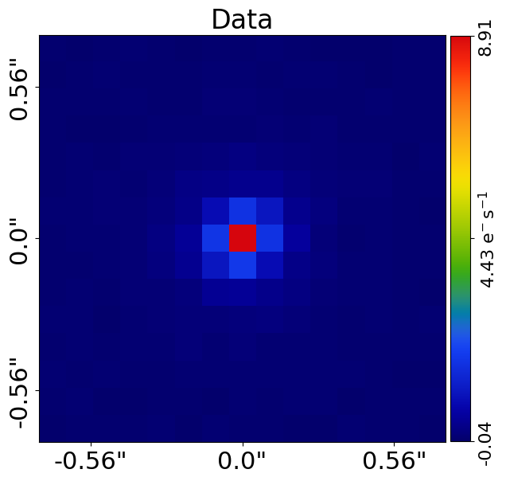
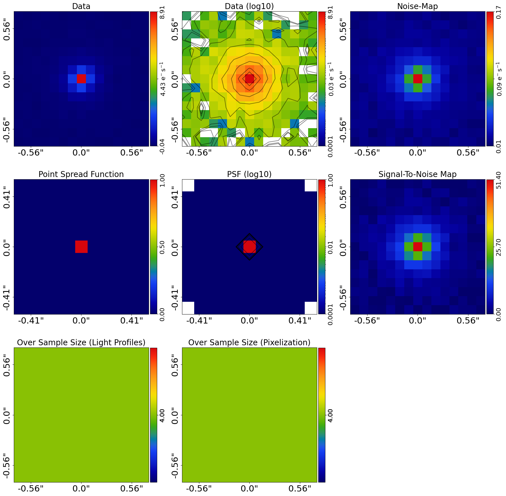
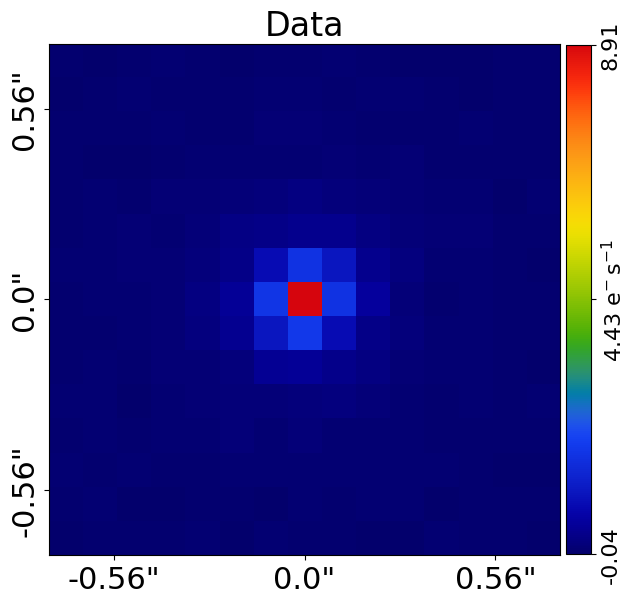

> ✏️ **This page is auto-generated from [`scripts/chapter_1_introduction/tutorial_0_visualization.py`](../../scripts/chapter_1_introduction/tutorial_0_visualization.py) — do not edit it directly.**
> It shows the example fully executed, with its real output images.
> Run it yourself via the [Python script](../../scripts/chapter_1_introduction/tutorial_0_visualization.py) or the [Jupyter notebook](../../notebooks/chapter_1_introduction/tutorial_0_visualization.ipynb).

Tutorial 0: Visualization
=========================

In this tutorial, we quickly cover visualization in **PyAutoGalaxy** and make sure images display clearly in your
Jupyter notebook and on your computer screen.

__Contents__

- **Directories:** Set the working directory so PyAutoGalaxy can find configs, data and output folders.
- **Dataset:** Load an example imaging dataset of a galaxy.
- **Plot Customization:** Customize matplotlib options like title, figure size and colormap.
- **Subplots:** Plot all components of a dataset simultaneously using subplots.
- **Visuals:** Add visual overlays like masks and grids to figures.
- **Wrap Up:** Summary of visualization in PyAutoGalaxy.


```python

from autoconf import setup_notebook; setup_notebook()
```

    2026-07-11 16:20:09,770 - matplotlib.font_manager - INFO - Failed to extract font properties from /usr/share/fonts/truetype/noto/NotoColorEmoji.ttf: Can not load face (unknown file format; error code 0x2)


    2026-07-11 16:20:09,868 - matplotlib.font_manager - INFO - generated new fontManager


    Working Directory has been set to `HowToGalaxy`


If the printed working directory does not match the workspace path on your computer, you can manually set it
as follows (the example below shows the path I would use on my laptop. The code is commented out so you do not
use this path in this tutorial!


```python
# workspace_path = "/Users/Jammy/Code/PyAuto/autogalaxy_workspace"
# #%cd $workspace_path
# print(f"Working Directory has been set to `{workspace_path}`")
```

__Dataset__

The `dataset_path` specifies where the dataset is located, which is the
directory `autogalaxy_workspace/dataset/imaging/simple__sersic`.

There are many example simulated images of galaxies in this directory that will be used throughout the
**HowToGalaxy** lectures.


```python
from pathlib import Path

import autogalaxy as ag
import autogalaxy.plot as aplt

dataset_path = Path("dataset", "imaging", "simple__sersic")
```

__Dataset Auto-Simulation__

If the dataset does not already exist on your system, it will be created by running the corresponding
simulator script. This ensures that all example scripts can be run without manually simulating data first.


```python
if not dataset_path.exists():
    import subprocess
    import sys

    subprocess.run(
        [sys.executable, "scripts/simulators/sersic.py"],
        check=True,
    )

```

We now load this dataset from .fits files and create an instance of an `imaging` object.


```python
dataset = ag.Imaging.from_fits(
    data_path=dataset_path / "data.fits",
    noise_map_path=dataset_path / "noise_map.fits",
    psf_path=dataset_path / "psf.fits",
    pixel_scales=0.1,
)
```

We can plot the data as follows:


```python
aplt.plot_array(array=dataset.data, title="Data")
```


    

    


__Plot Customization__

Does the figure display correctly on your computer screen?

If not, you can customize common matplotlib options by passing them directly to `plot_array`:

 - `title=`: Set the figure title.
 - `figsize=`: Control the figure size as a `(width, height)` tuple.
 - `colormap=`: Set the matplotlib colormap name (e.g. `"jet"`, `"gray"`).
 - `xlabel=`, `ylabel=`: Override the default axis labels.


```python
aplt.plot_array(
    array=dataset.data,
    title="Data",
)
```


    

    


Many matplotlib options can be customized, but for now we're only concerned with making sure figures display clear in
your Jupyter Notebooks. Nevertheless, a comprehensive API reference guide of all available plot arguments can
be found in the `autogalaxy_workspace/*/guides/plot` package. You should check this out once you are more familiar with
**PyAutoGalaxy**.

Ideally, we would not specify a `figsize` every time we plot an image. Fortunately, default values can be fully
customized via the config files.

Checkout the `mat_wrap.yaml` file in `autogalaxy_workspace/config/visualize/mat_wrap`.

All default matplotlib values are here. There are a lot of entries, so lets focus on whats important for displaying
figures:

 - mat_wrap.yaml -> Figure -> figure: -> figsize
 - mat_wrap.yaml -> YLabel -> figure: -> fontsize
 - mat_wrap.yaml -> XLabel -> figure: -> fontsize
 - mat_wrap.yaml -> TickParams -> figure: -> labelsize
 - mat_wrap.yaml -> YTicks -> figure: -> labelsize
 - mat_wrap.yaml -> XTicks -> figure: -> labelsize

Don't worry about all the other files or options listed for now, as they'll make a lot more sense once you are familiar
with **PyAutoGalaxy**.

If you had to change any of the above settings to get the figures to display clearly, you should update their values
in the corresponding config files above (you will need to reset your Jupyter notebook server for these changes to
take effect, so make sure you have the right values using the `figsize` argument in the cell above beforehand!).

__Subplots__

In addition to plotting individual figures, **PyAutoGalaxy** can also plot subplots showing all components of a
dataset simultaneously.

Lets plot a subplot of our `Imaging` data:


```python
aplt.subplot_imaging_dataset(dataset=dataset)
```


    

    


__Visuals__

Visuals can be added to any figure by passing them as keyword arguments directly to `plot_array`.

For example, we can plot a mask on the image above by passing `mask=mask`.

The `visuals` example illustrates every overlay argument, for example `mask=`, `grid=`, `positions=`, `lines=`, etc.


```python
mask = ag.Mask2D.circular_annular(
    shape_native=dataset.shape_native,
    pixel_scales=dataset.pixel_scales,
    inner_radius=0.3,
    outer_radius=3.0,
)

aplt.plot_array(array=dataset.data, title="Data")
```


    

    


__Wrap Up__

Throughout lectures you'll see lots more visuals that are plotted on figures and subplots.

Great! Hopefully, visualization in **PyAutoGalaxy** is displaying nicely for us to get on with the **HowToGalaxy**
lecture series.


```python

```
